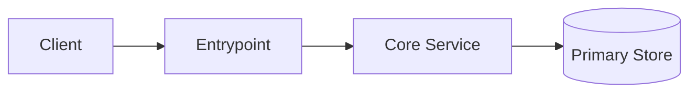
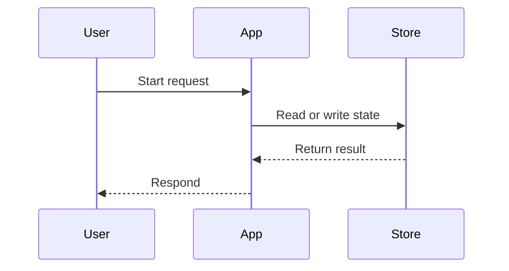
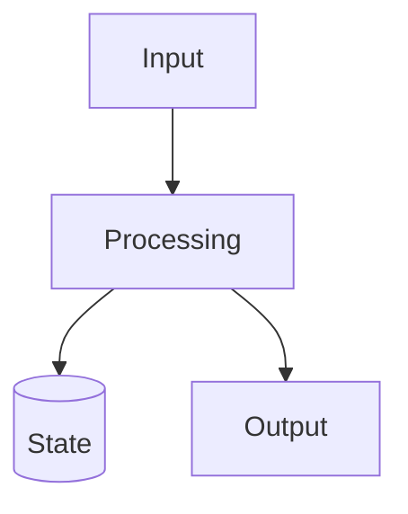

# Design

This document is the default architecture and workflow reference for the project.
Keep it aligned with the current codebase.
Prefer Mermaid blocks embedded directly in Markdown so GitHub and Obsidian render diagrams without extra tooling.

## System Overview
- Replace the example sections below with the project's actual components, boundaries, and flows.
- Keep diagrams short and grounded in implemented behavior or explicitly planned work.

## Architecture

## Main Workflow

## Data Flow

## Key Components
- Entrypoint:
- Core Service:
- Storage:

## Invariants
- Document the rules that should stay true even as implementation changes.

## Open Questions
- Track design uncertainties here or link to deeper docs when needed.
